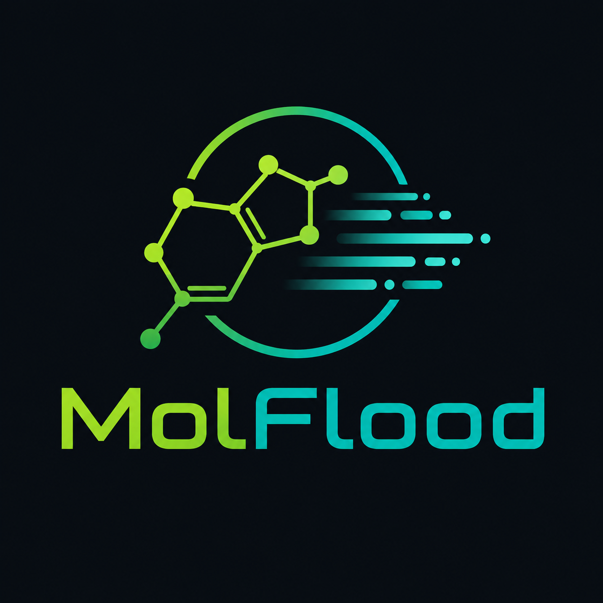

<p align="center">
  
</p>

# MolFlood

**Docking Score Prediction Pipeline**

# Description

MolFlood is an open, reproducible machine-learning workflow designed for the prediction of molecular docking scores from extremely large molecule libraries at an outstanding speed, based on the molecular structure. Its emphasis is on therapeutic targets associated with **neglected and understudied diseases**.

The long-term goal is to provide support both for a reusable prediction pipeline and for a community-driven collection of validated, target-specific MolFlood models.

## Workflow overview

<p align="center">
  
</p>

## What is a docking score?

Molecular docking computationally evaluates possible binding poses of a small molecule (ligand) within a binding site of a molecular target. A **docking score** is the numerical value produced by the scoring function of the docking software to rank or evaluate these predicted poses.

In many commonly used docking protocols, more favorable docking scores are represented by lower (more negative) values. However, the numerical meaning, scale, and direction of the score depend on the docking software, scoring function, and protocol used.

A docking score should **not** be interpreted as an experimentally measured binding affinity. It is a computational score generated under a particular docking protocol and is primarily useful for comparing and prioritizing
molecules evaluated under compatible conditions.

MolFlood learns the relationship between molecular structure and docking scores previously generated for a specific target and docking protocol. It can then rapidly estimate docking scores for new molecules within that same modeling context.

## Why MolFlood?

Large-scale molecular docking campaigns can require substantial computational resources, particularly when very large molecular libraries need to be evaluated. This can represent an important limitation for research groups with restricted access to high-performance computing infrastructure.

MolFlood was designed to enable **very rapid ML-assisted screening of molecular libraries using previously trained and validated MolFlood models**. Once a target-specific model has been trained, new molecules can be prioritized at a fraction of the computational cost normally associated with performing a new docking calculation for every compound.

The goal is not to replace molecular docking or experimental validation. Instead, MolFlood is intended as a **molecular prioritization tool**: machine learning can rapidly screen large collections of molecules and help researchers identify subsets that deserve subsequent computational or experimental investigation.

This approach is particularly relevant to the broader mission of MolFlood: supporting research on **neglected and understudied diseases**, including research environments where access to extensive computational infrastructure may be limited.

As the MolFlood community grows, validated target-specific models may be shared through the project repository, allowing researchers to perform rapid local predictions without having to reproduce the original model-training process. Each model should remain associated with its target, docking protocol, validation results, applicability domain, and provenance metadata.

## Scientific scope

MolFlood predicts **docking scores generated under a documented computational docking context**.

A MolFlood prediction should not be interpreted as experimental binding affinity, IC50, Ki, Kd, direct biological activity, or therapeutic efficacy.

MolFlood models are target- and protocol-specific and should not be assumed to transfer to another biological target or incompatible docking protocol without retraining and validation.

## Current release

MolFlood v1.0.0

The workflow includes:

- Morgan fingerprints;
- RDKit physicochemical descriptors;
- structural train/test splitting;
- GroupKFold structural validation;
- training-only algorithm selection;
- Optuna hyperparameter optimization;
- DummyRegressor baseline;
- RMSE, MAE, R², and Spearman metrics;
- top-k/ranking evaluation;
- bootstrap analysis;
- Y-scrambling;
- Morgan/Tanimoto applicability domain;
- Morgan-bit interpretation;
- XAI techniques;
- dataset/model SHA-256 hashes;
- environment and dependency metadata;
- Model Card generation;
- external prediction;
- external evaluation against independent redocking/reference scores.

## Molecular representation

MolFlood uses Morgan fingerprints as the main structural representation and enriches them with RDKit physicochemical descriptors computed from SMILES.

Morgan fingerprints remain the default because they are strong, scalable, and widely used for QSAR-like tabular molecular modeling. Additional fingerprint families were intentionally removed from the current workflow to reduce dimensionality, noise, and unnecessary computational cost.

Future versions of MolFlood may incorporate and systematically evaluate additional molecular fingerprint representations, enabling broader comparisons of their impact on predictive performance, generalization, and computational efficiency.

## Installation

Recommended Python:

```text
Python 3.12-3.14
```

Install dependencies:

```bash
python -m pip install -r requirements.txt
```

## Training input

Minimum schema:

```csv
smiles,docking_score
CCO,-5.8
c1ccccc1,-6.4
```

The training dataset is expected to have been deduplicated before entering MolFlood.

## Basic workflow

1. Install dependencies.
2. Open the notebook in `notebooks/`.
3. Fill the **USER CONFIGURATION** cell.
4. Place `dataset.csv` in the configured project folder.
5. Restart the Python kernel.
6. Run the notebook from top to bottom.
7. Inspect validation, applicability domain, and interpretation outputs.
8. Use the saved model for external prediction.
9. If independent redocking/reference scores become available, evaluate them in the notebook.

## Tutorial dataset

A developer-provided tutorial dataset is planned for the public release workflow so users can verify their environment and learn the outputs before applying MolFlood to their own docking campaigns.

## Applicability domain

External predictions include Morgan/Tanimoto-based applicability-domain information such as:

```text
docking_score_predicted
max_tanimoto_to_training
within_applicability_domain
```

Outside-domain predictions represent stronger chemical extrapolation and should be interpreted with additional caution.

## Community vision

MolFlood is intended to evolve into a community-driven resource for neglected and understudied disease research.

Researchers will be encouraged to train and validate target-specific MolFlood models and submit standardized model packages for review. Accepted models should include sufficient provenance, validation, applicability-domain information, software versioning, and redistribution metadata.

The formal MolFlood Community Model Standard will be defined separately.

## Security

MolFlood currently serializes trained Python models with Joblib.

**Do not load an unreviewed `.joblib` artifact from an untrusted source in a trusted environment.**

## Contributing

See [CONTRIBUTING.md](CONTRIBUTING.md).

## Citation

Citation metadata are provided in `CITATION.cff`.

Users should cite the **specific MolFlood version** used in a scientific analysis. A DOI can be added after an archived Zenodo release is created.

## License

MolFlood source code is released under the **MIT License**.

See [LICENSE](LICENSE).

## Authors

- Davidt Tarouco
- Dr. Conrado Pedebos
- Dr. Rodrigo Ligabue-Braun

## Release status

MolFlood v1.0.0 is the **first stable public release** of the pipeline. This version has been validated through complete workflow execution and is intended to provide a reproducible, local-first framework for machine-learning-assisted docking score prediction and molecular prioritization.

# Do you want to cite this work?

**Developed by:** Davidt Tarouco, Dr. Conrado Pedebos, and Dr. Rodrigo Ligabue-Braun. (add Zenodo DOI)
